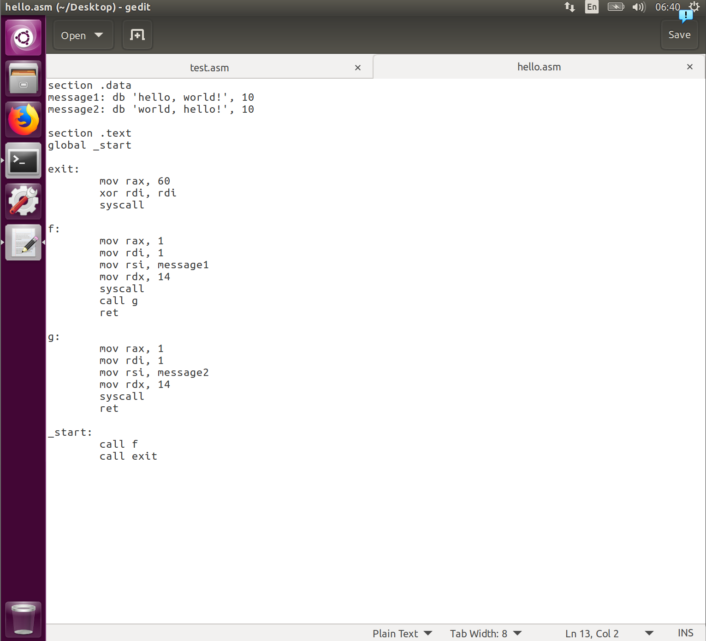
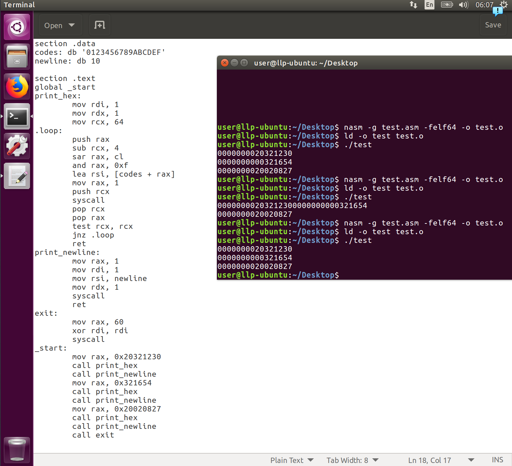
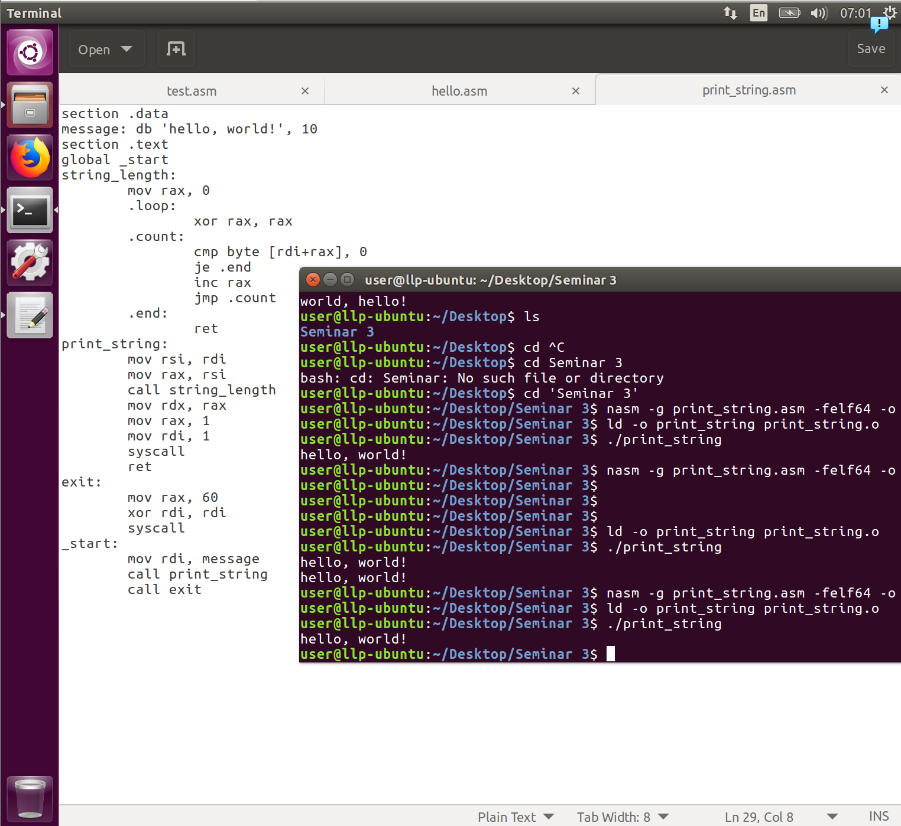
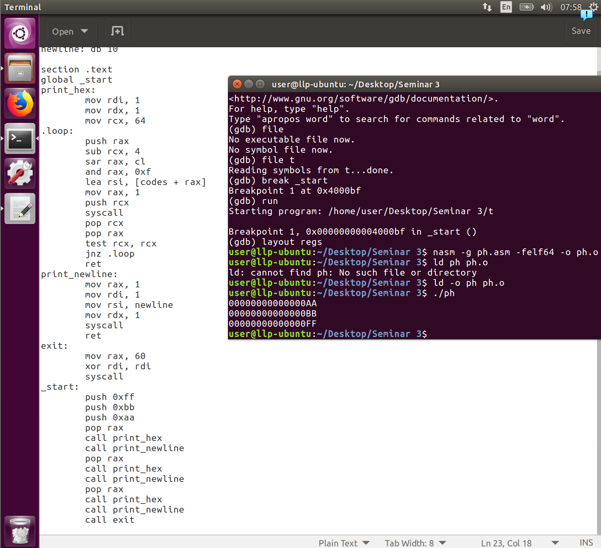
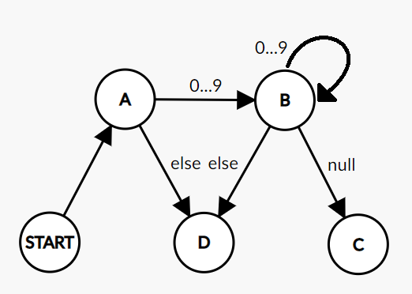
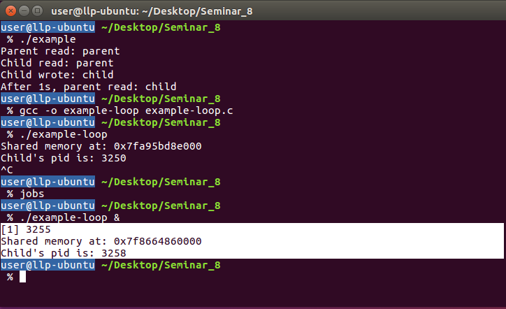
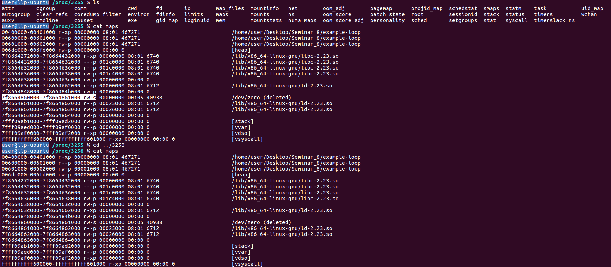
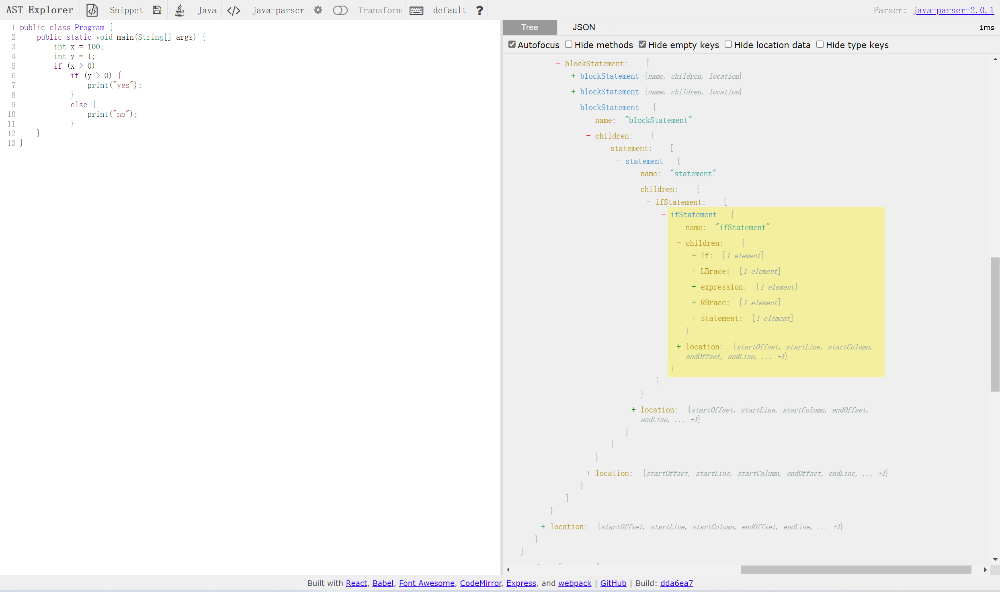

# Seminar 1

##### What are stdin, stdout, stderr?

Stdin is short for standard input, which is an input stream where data is sent to and read by a program (defultly, from keyboard).
Stdout and stderr is short of standard output and standard error, which is the default file descriptor where a process can write output/error message.

##### How to connect the output of one program to the input of another?

Redirection

##### When is it appropriate to use stdout and when is it useful to use stderr?

It is appropriate to use stdout for all interactions, whether users or other programs. And for stderr, it is used in diagnostic messages (including debug mode notifications and special progress bars).
Why? Because 1. if the output is specified to be a file, the output of stdout goes to that file, while stderr continues to output to the screen. 2. stdout is line buffered, which means that the contents of the file will be sent to the specified file (whether it is the screen device file or any other general file) only when there is a newline character. stderr , on the other hand, doesn't have a buffer, so if it has bytes of content, it outputs.

##### How to find lines from one (any) character?

`grep '^.\{1\}$' test` 

##### How to find strings with numbers?

`grep [0-9] test` 

##### How to direct the result of a command to a file?

use output redirection symbol, like command > filename or command >> filename.

##### How to find lines where there is a word of three letters?

`grep '^.\{3\}$' test` 

##### How do I find blank lines?

`grep '^$' test` 

##### Which key, when running grep, inverts the search results, i.e. looking for strings that don't match a pattern? (Use man grep)

`-v`

##### What does parameter -f elf64 mean? (use man nasm)

`-f` means format, select an output format.
`elf64` means 64-bit Executable and Linkable Format.

##### What does parameter -g mean? (use man nasm)

`-g` means generate debug information in selected format.

##### What is a debugger? (use Baidu to answer)

A debugger is a software program used to test and find bugs (errors) in other programs.
A debugger is also known as a debugging tool.

# Seminar 2

##### What is the connection between rax, eax, ax, ah, and al?

rax, eax, ax, ah, al actually represent the same register,but contain different ranges, that rax is 64 bits, eax is 32 bits, ax is 16 bits, ah is the upper 8 bits of ax, and al is the lower 8 bits of ax.

##### What is a section? What are they needed for?

Section indicates that the code is divided into several sections.
When the program is loaded and executed by the operating system,each section is loaded to a different address,and the operating system sets different read,write,and execute permissions for different sections.

##### What is a label?

A label is a readable name and address which is used to get rid of numeric address values.

##### What does the instruction xor r, r mean? Here r — can be any register?

xor r, r: Do logical exclusive-or operation on r itself.
r can be most registers but in example: in 64-bit mode, r/m8 can not be encoded to access the following byte registers if a REX prefix is used: AH, BH, CH, DH.

##### Which ones of these instructions are incorrect and why?

##### What is the meaning of rip register?

rip register stores the pointer to the current program

##### What is the program return code?

After a program ends, return the CPU control to the program that enables it to run. In other words, this s a status about exit code.

##### Where does the program execution start?

From the label `_start:`

##### (gdb) print $rax

`$1 = 1`

##### Explain what does the previous instruction mean.

print the rax register content after 3 times si instruditions

##### (gdb) print /c message

`$2 = 104 'h'`

##### Explain what does the previous instruction mean.

print the first character of the line that is at the msg label

##### (gdb) x /i &_start

`0x4000b0 <_start>: mov eax,0x1`

##### Explain what does the previous instruction mean.

watch the contents of the memory, `/i` means disassemble the instruction starting from the given address `&_start`.

##### (gdb) x /i $rip

`0x4000c4 <_start+20>: mov edx,0xe`

##### Explain what does the previous instruction mean.

watch the contents of the memory, `/i` means disassemble the instruction starting from the given address `&rip`.

##### (gdb) x /xg $rsp

`0x7fffffffdedd0: 0x00000000000000001`

##### Explain what does the previous instruction mean.

watch the contents of the memory, `/xg` means hexadecimal and giant, 8 bytes for `$rsp`.

##### To use gdb efficiently, we use the -g compilation switch, like in gcc -ggdb call_stack.c -o call_stack. Please explain why we do this. (Use Using_gdb.pdf document )

The "-g"option adds information about the source code to the executable,such as the number of machine instructions in the executable that correspond to the number of lines in the source code. Therefore,during debugging,you must ensure that gdb can find the source file.

# Seminar 3

##### Step through the program in gdb and follow the stack pointer (rsp register). How does the call and ret instructions affect it?

There are two status for `rsp`, one is `0x7fffffffddd0` (beginning, top of the current stack frame) and one  is `0x7fffffffddc8` (template, address for a sub-function).
`call` will let `rsp` change from `beginning / 0x7fffffffddd0` to `template / 0x7fffffffddc8`, and `ret` will roll `rsp` back to `beginning / 0x7fffffffddd0` from `template / 0x7fffffffddc8`.

##### Refer to the Intel software developer manual and read the pages corresponding to the call and ret instructions. Describe the effect of these instructions on memory and registers.

The call instruction calls near procedures using a full pointer. call causes the procedure named in the operand to be executed. When the called procedure completes, execution flow resumes at the instruction following the call instruction.
The ret instruction transfers control to the return address located on the stack. This address is usually placed on the stack by a call instruction. Issue the ret instruction within the called procedure to resume execution flow at the instruction following the call.

##### What if function f calls function g? Write a program that has such functions and calls; follow it step by step in gdb and follow the stack pointer (rsp register).



##### Why didn't we write a ret statement at the end of the exit function?

The process has been terminated and the system has recycled the stack that was used.

##### Extract from the following code (taken from page 22 of the Chapter 2 document) the function print_hex, which will take an argument in the correct register (like in the Hello world program) and print it to the screen. Use it to print any three numbers.



##### What registers are used for function arguments?

`rdi rsi rdx r10 r8 r9`

##### Is there a difference between these two calls to f with two arguments?

```assembly
mov rdi,10
mov rsi, 30
call f

mov rsi, 30
mov rdi,10
call f
```

No, maybe. I find they are same when call f.

##### Read section 2.5.2 of the Chapter 2 document. Rewrite the following program so that print_string takes a null-terminated string as the only argument.



##### What are callee-saved and caller-saved registers? What is the difference between using them when calling functions?

Callee-saved registers must be restored by the procedure being called. So, if it needs to change them, it has to change them back.
Caller-saved registers should be saved before invoking a function and restored after. One does not have to save and restore them if their value will not be of importance after.

##### Why not make all registers callee-saved?

If every register is callee-saved, that's mean no changes on registers after procedual call, the callee store all register on beginning and  change them back at the end.

##### Will this assembly code work? Is it correct in terms of agreements?

```assembly
; rdi = string address
string_length:
xor rax, rax
.counter:
cmp byte [rdi+rax], 0
je .end
inc rax
jmp .counter
.end:
ret

; rdi = string address
print_string:
call string_length
mov rdx, rax
mov rax, 1
mov rsi, rdi
mov rdi, 1
syscall ; call write
ret
```

This assembly code can work. And it is correct in terms of agreements for code have saving and restoring callee-saved registers.

##### Will this assembly code work? Is it correct in terms of agreements?

```assembly
; rdi = string address
string_length:
mov rax, rdi
.counter:
cmp byte [rdi], 0
je .end
inc rdi
jmp .counter
.end:
sub rdi, rax
mov rax, rdi
ret

; rdi = string address
print_string:
call string_length
mov rdx, rax
mov rax, 1
mov rsi, rdi
mov rdi, 1
syscall ; call write
ret
```

This assembly code will not work. But it is correct in terms of agreements for code have saving and restoring callee-saved registers.

##### Is there any difference between the following memory allocation methods?

```assembly
; First way
sub rsp, 24

; Second way
push 0
push 0
push 0
```

Although the result is the same, there is a difference in the operation

```
; First way
<_start> 0x7fffffffddc0
<f> 0x7fffffffddb8
<f+4> 0x7fffffffdda0
<No Asm> 0x7fffffffdda8

; Second way
<_start> 0x7fffffffddc0
<f> 0x7fffffffddb8
<f+2> 0x7fffffffddb0
<f+4> 0x7fffffffdda8
<f+6> 0x7fffffffdda0
<No Asm> 0x7fffffffdda8
```

##### Write a function that allocates space on the stack for three local variables. Then it writes aa, bb, and ff there, and then displays them. Then it should terminate gracefully.



# Seminar 4

##### Which chain of transitions will the automaton go through on input line 01001? We assume that there are no reactions. Give the answer in a format like: “start ->A->…”

start ->A (0) ->A(1) ->B(0) ->B(0) ->B(1) ->A

##### Code an automaton that checks if a string is a number (i.e. that it matches a regular expression \s*[0-9]+\s* ). Check that your code works correctly! Insert your code here.

```assembly
section .data
message: 
    db      ' 20321230 ', 11
t: 
    db      '1', 2
f: 
    db      '0', 2

section .text
global _start

exit:
    	mov     rax, 60            ; invoke 'exit' system call
    	xor     rdi, rdi
    	syscall

new_line:
    	mov rax, 1
    	mov rdi, 1
    	lea rsi, [codes + 0x10]
    	mov rdx, 1
    	syscall
    	ret
print_t:
	mov rax, 1 ; 'write' syscall number
	mov rdi, 1 ; stdout descriptor
	mov rsi, t ; string address
	mov rdx, 1 ; string length in bytes
	syscall
	ret
print_f:
	mov rax, 1 ; 'write' syscall number
	mov rdi, 1 ; stdout descriptor
	mov rsi, f ; string address
	mov rdx, 1; string length in bytes
	syscall
	ret

getsymbol:
	xor al, al          ; clear r8  
	mov al, byte[rdi]; char at address rdi -> al
	inc rdi
	ret
_A:
	call getsymbol
	cmp al, ' '
	je _B
	jmp _D
_B:
	call getsymbol
      cmp r8, '9'
      jg _D
      cmp r8, '0'
      jl _D
	jmp _C
_C:
	call getsymbol
	cmp al, ' '
	je _E
      cmp r8, '9'
      jg _D
      cmp r8, '0'
      jl _D
	jmp _C
_D:
	call print_f
	ret		
_E:
	call getsymbol
	test al, al
	jz _F
	jmp _D
_F:
	call print_t
	ret

_start:
    	mov rdi, message
	call _A
	call new_line
	call exit
```

##### Draw an automaton for the parse_uint function (page 35 in Chapter 2 document) based on the template from one of the previous paragraphs; Send here the screenshot or a photo.



##### Draw an automaton for the parse_uint function (page 35 in Chapter 2 document) based on the template from one of the previous paragraphs; supply its transitions between states with actions on registers. The result of the number parsed from the string should be placed in rax, and the number of characters in it - in rdx. Code this automaton in assembly, check that it works properly and copy your code here.

```assembly
section .data
codes:
    db      '0123456789ABCDEF', 18
message: 
    db      '12hello', 8

section .text
global _start

exit:
    mov     rax, 60            ; invoke 'exit' system call
    xor     rdi, rdi
    syscall
print_hex:
    mov rax, 1
    mov rdx, 1
    mov rcx, 64
    ; Each 4 bits should be output as one hexadecimal digit
    ; Use shift and bitwise AND to isolate them
    ; the result is the offset in 'codes' array
.loop:
    push rdi
    sub rcx, 4
    ; cl is a register, smallest part of rcx
    ; rax -- eax -- ax -- ah + al
    ; rcx -- ecx -- cx -- ch + cl
    sar rdi, cl
    and rdi, 0xf
    lea rsi, [codes + rdi]
    mov rdi, 1
    ; syscall leaves rcx and r11 changed
    push rcx
    syscall
    pop rcx
    pop rdi
    ; test can be used for the fastest 'is it a zero?' check
    ; see docs for 'test' command
    test rcx, rcx
    jnz .loop
    ret
_A:
	xor r8, r8          ; clear r8
	mov r8b, byte[rdi]  ; char at address rdi -> r8
	cmp r8, '9'         ; check, that char is a digit
	ja _B
	cmp r8, '0'
	jb _B
	sub r8, '0'         ; convert r8 char to int
	mul r10             ; rax * r10 -> (rdx rax), slice left by one digit
	add rax, r8         ; add last digit to rax
	inc rdi             ; rdi++, so take new char   
	inc rcx             ; rcx++ or number_len++
	jmp _A
_B:
	mov rdx, rcx        ; number_len -> rdx
    ret
new_line:
    mov rax, 1
    mov rdi, 1
   	lea rsi, [codes + 0x10]
    mov rdx, 1
    syscall
	ret
_start:
    mov rdi, message
	mov r10, 10     ;   base of decimal system
    xor rax, rax    ;   0 -> rax, rax - number accumulator
    xor rcx, rcx    ;   0 -> rcx, rcx - number_len counter
    call _A
    mov rdi, rax
    call print_hex
	call new_line
    call exit
```

##### Take a close look at all the functions that need to be implemented in the first assignment (page 35 in Chapter 2 document). For which of them is it convenient to first draw an automaton, and then code it in assembly?

read_word

# Seminar 5

##### Run the following code through the preprocessor and observe the result. Rewrite this macro so that it adds a comma between lines of text passed to it. Insert the code to the form.

```assembly
%macro test 3
db %1
db %2
db %3
%endmacro

test "hello", ",", " world"
```

```assembly
%macro test 3
db %3
db %2
,
db %2
db %1
%endmacro

test "hello", ",", " world"
```

##### In the Seminar 3, you worked with the print_hex function. Create a program from two files: one contains the print_hex function, the other contains the _start label and calls print_hex. Compile them and run the program. What commands are required to guide both code files through the entire compilation cycle? Insert these commands to the form.

```assembly
; for file contains _start label ;
extern print_hex
...
call print_hex

; for file contains print_hex function ;
global print_hex
print_hex:
	some code
```

##### Explain the meaning of the second column (use man).

```
\> nm symbols.o
00000000000000000 T _start
0000000000000000 d message
```

These symbols represent the portion of memory that the current entry corresponds to.
T means the symbol is in the text (code) section.
d means the symbol is in the initialized data section.

##### We will examine executable and object files using the readelf, nm, and objdump utilities. Figure out and insert to the form commands to view the symbol table in the *.o file using all three (man contains the information you need).

```
\> readelf -s *.o
\> mn *.o
\> objdump -t *o
```

##### Can several .o files contain labels with the same name?

No, if do this, a error "multiple definition of 'same name'" will occur.

##### Take a file symbols.o. Run these commands. Examine the fields Offset, Sym.Value, Sym. Name + Addend and understand and write what they correspond to in the disassembler output from objdump.

```
\> objdump -M intel-mnemonic -d symbols.o
\> readelf --relocs symbols.o
```

```
user@llp-ubuntu:~/Desktop/Seminar_5$ objdump -M intel-mnemonic -d s.o

s.o:     file format elf64-x86-64


Disassembly of section .text:

0000000000000000 <_start>:
   0:	48 be 00 00 00 00 00 	movabs rsi,0x0
   7:	00 00 00 
```

# Seminar 6

##### In the context of make, what are rule, target, prerequisites? Please, answer in your own words.

rule is related operations and infos for the target like below:
`<target>:<prerequisites>
		[commandd]...` 

target is a target File. It can be an Object File or an execution file, and it could also be a Label.

prerequisites is these files you need to generate that target.

##### What is a phony target? Please, explain in your own words.

A phony target is one that is not really the name of a file, it is just a name for a recipe to be executed when you make an explicit request.
If we just want to do something and do not have a necessary file, phony target is useful.

##### Read section 2.3 in the make documentation (https://www.gnu.org/software/make/manual/make.html#How-Make-Works). What happens if you don't explicitly state the target? What is the default first target? Is it always the "all"?

If you don't explicitly state the target, by default, make will start with the first target. 
This is not a empty target or a phony target, it should have a target File. So it may not the first.
So the target is the default goal, not all.

##### Read about automatic variables \$@, \$< (https://www.gnu.org/software/make/manual/html_node/Automatic-Variables.html). Rewrite the Makefile above to use them. Place the code here.

```
ASM=nasm
ASMFLAGS=-f elf64
LD=ld

a.o: a.asm
$(ASM) $(ASMFLAGS) -o $@ $<

b.o: b.asm a.o
$(ASM) $(ASMFLAGS) -o $@ $<

c.o: c.asm a.o
$(ASM) $(ASMFLAGS) -o $@ $<

program: a.o b.o c.o
$(LD) -o $@ $^
```

##### Read about pattern rules (https://www.gnu.org/software/make/manual/html_node/Pattern-Intro.html). Rewrite the Makefile above using pattern rule for creating an object file from any assembly file. Place the code here.

```
ASM=nasm
ASMFLAGS=-f elf64
LD=ld

a.o: a.asm
$(ASM) $(ASMFLAGS) -o $@ $<

%.o: %.asm a.o
$(ASM) $(ASMFLAGS) -o $@ $<

program: a.o b.o c.o
$(LD) -o $@ $^
```

##### Write a Makefile for a program from the previous seminar, consisting of two files; one contains the exit and print_hex functions, and the other contains their calls. Place the Makefile code here.

```
ASM=nasm
ASMFLAGS=-f elf64
LD=ld

program: test2_start.o test2_print.o
$(LD) -o $@ $^

test2_start.o: test2_start.asm test2_print.o
$(ASM) $(ASMFLAGS) -o $@ $<

test2_print.o: test2_print.asm
$(ASM) $(ASMFLAGS) -o $@ $<
```

# Seminar 7

##### What data is stored inside the file /proc/PID/environ?

The environment variables of a process ID.

##### Insert here the contents of the /proc/PID/maps file, where PID is the ID of the process you started in the background.

```
00400000-00401000 r-xp 00000000 08:01 545271                             /home/user/Desktop/Seminar_7/res
00600000-00601000 rwxp 00000000 08:01 545271                             /home/user/Desktop/Seminar_7/res
7ffc61223000-7ffc61244000 rwxp 00000000 00:00 0                          [stack]
7ffc612d8000-7ffc612db000 r--p 00000000 00:00 0                          [vvar]
7ffc612db000-7ffc612dd000 r-xp 00000000 00:00 0                          [vdso]
ffffffffff600000-ffffffffff601000 r-xp 00000000 00:00 0                  [vsyscall]
```

##### Why in the regions the starting and ending addresses in hexadecimal format always end with three zeros?

> Each process is isolated from others in its own address space. The process address space is  divided into pages of equal size, usually 4 KB. Pages, therefore, cannot start from an arbitrary  address, but only from an address that is a multiple of 4 KB.

So need zero: $log_{16}{(4*1024*8)}=3$.

##### For this maps file contents, define at least one forbidden address range. Insert this range to the gap:

```
00400000-00401000 r-xp 00000000 08:01 144225 /home/stud/main
00600000-00601000 rwxp 00000000 08:01 144225 /home/stud/main
7fff11ac0000-7fff11ae1000 rwxp 00000000 00:00 0 [stack]
7fff11bfc000-7fff11bfe000 r-xp 00000000 00:00 0 [vdso]
7fff11bfe000-7fff11c00000 r--p 00000000 00:00 0 [vvar]
ffffffffff600000-ffffffffff601000 r-xp 00000000 00:00 0 [vsyscall]
```

00401001-00402000

##### Please write here what data is in every column of maps file? Read about the /proc/PID/maps file in man procfs.

From left to right: address perms offset dev inode pathname.

       /proc/[pid]/maps
              A file containing the currently mapped memory regions and  their
              access  permissions.   See  mmap(2) for some further information
              about memory mappings.
    
              The format of the file is:
    
       address           perms offset  dev   inode       pathname
       00400000-00452000 r-xp 00000000 08:02 173521      /usr/bin/dbus-daemon
       00651000-00652000 r--p 00051000 08:02 173521      /usr/bin/dbus-daemon
       00652000-00655000 rw-p 00052000 08:02 173521      /usr/bin/dbus-daemon
       00e03000-00e24000 rw-p 00000000 00:00 0           [heap]
       00e24000-011f7000 rw-p 00000000 00:00 0           [heap]
       ...
       35b1800000-35b1820000 r-xp 00000000 08:02 135522  /usr/lib64/ld-2.15.so
       35b1a1f000-35b1a20000 r--p 0001f000 08:02 135522  /usr/lib64/ld-2.15.so
       35b1a20000-35b1a21000 rw-p 00020000 08:02 135522  /usr/lib64/ld-2.15.so
       35b1a21000-35b1a22000 rw-p 00000000 00:00 0
       35b1c00000-35b1dac000 r-xp 00000000 08:02 135870  /usr/lib64/libc-2.15.so
       35b1dac000-35b1fac000 ---p 001ac000 08:02 135870  /usr/lib64/libc-2.15.so
       35b1fac000-35b1fb0000 r--p 001ac000 08:02 135870  /usr/lib64/libc-2.15.so
       35b1fb0000-35b1fb2000 rw-p 001b0000 08:02 135870  /usr/lib64/libc-2.15.so
       ...
       f2c6ff8c000-7f2c7078c000 rw-p 00000000 00:00 0    [stack:986]
       ...
       7fffb2c0d000-7fffb2c2e000 rw-p 00000000 00:00 0   [stack]
       7fffb2d48000-7fffb2d49000 r-xp 00000000 00:00 0   [vdso]
    
              The address field is the address space in the process  that  the
              mapping occupies.  The perms field is a set of permissions:
    
                   r = read
                   w = write
                   x = execute
                   s = shared
                   p = private (copy on write)
    
              The  offset  field  is the offset into the file/whatever; dev is
              the device (major:minor); inode is the inode on that device.   0
              indicates that no inode is associated with the memory region, as
              would be the case with BSS (uninitialized data).
    
              The pathname field will usually be the file that is backing  the
              mapping.  For ELF files, you can easily coordinate with the off‐
              set field by looking at the Offset  field  in  the  ELF  program
              headers (readelf -l).
    
              There are additional helpful pseudo-paths:
    
                   [stack]
                          The  initial  process's  (also  known  as  the  main
                          thread's) stack.
    
                   [stack:<tid>] (since Linux 3.4)
                          A thread's stack (where the <tid> is a  thread  ID).
                          It corresponds to the /proc/[pid]/task/[tid]/ path.
    
                   [vdso] The virtual dynamically linked shared object.
    
                   [heap] The process's heap.
    
              If  the pathname field is blank, this is an anonymous mapping as
              obtained via the mmap(2) function.  There  is  no  easy  way  to
              coordinate  this back to a process's source, short of running it
              through gdb(1), strace(1), or similar.
    
              Under Linux 2.0, there is no field giving pathname.

##### Find in man mmap answers to the following questions:

- What arguments does mmap accept?

- What is their meaning?

- What is the argument in which register?

  void *addr, Specifies the memory address to be mapped, usually set to NULL to allow the operating system to automatically select the appropriate memory address.

  size_t length, The number of bytes in the mapped address space, counted from the beginning of the mapped file offset by one byte.

  int prot, Specifies access permissions for shared memory. The following values are optional: PROT_READ (readable), PROT_WRITE (writable), PROT_EXEC (executable), and PROT_NONE (inaccessible).

  int flags, It is specified by the following constants: MAP_SHARED (shared) MAP_PRIVATE (private), MAP_FIXED (indicates that the start parameter must be used as the start address. If the start parameter fails, it will not be corrected.), MAP_SHARED and MAP_PRIVATE are mandatory. MAP_FIXED is not recommended.

  int fd, Represents a file handle to be mapped.

  off_t offset, Indicates the offset of the mapping file. Generally, 0 indicates that the mapping starts from the header of the file.

##### Create a file hello.txt with a text "Hello, mmap!". Using the stub in seminar document, create a program that maps this file to memory and outputs the text from it. Place here the code.

```assembly
%define O_RDONLY 0 
%define PROT_READ 0x1
%define MAP_PRIVATE 0x2
%define SYS_OPEN 2
%define SYS_MMAP 9

section .data
	; This is the file name. You are free to change it.
	fname: db 'hello.txt', 0

section .text
global _start
exit:
	 mov rax, 60 ; use exit system call to shut down correctly
	 xor rdi, rdi
	 syscall
	; These functions are used to print a null terminated string
print_string:
	 push rdi
	 call string_length
	 pop rsi
	 mov rdx, rax 
	 mov rax, 1
	 mov rdi, 1 
	 syscall
	 ret
string_length:
	 xor rax, rax
.loop:
	 cmp byte [rdi+rax], 0
	 je .end 
	 inc rax
	 jmp .loop 
.end:
	 ret
_start:
	; Call open and open fname for read only.
	mov rax, SYS_OPEN
	mov rdi, fname
	mov rsi, O_RDONLY ; Open file read only
	mov rdx, 0 ; We are not creating a file
	 ; so this argument has no meaning
	syscall

	push rax
	mov r8, rax
	mov rax, SYS_MMAP
	mov rdi, 0x0
	mov rsi, 4096
	mov rdx, PROT_READ
	mov r10, MAP_PRIVATE
	mov r9, 0
	syscall

	mov rdi, rax
	push rdi
	call print_string

	mov rax, 11
	pop rdi
	mov rsi, 4096
	syscall

	mov rax, 2
	pop rdi
	syscall

	call exit
```

# Seminar 8

##### What exactly does fork() return in the parent process? And what's in the child?

In the parent process, fork returns the process ID of the newly created child process;
In the child process, fork returns 0.

But if an error occurs, fork returns a negative value.

##### Compile and run the program. What is the output? Place it to the form.

Parent: my pid = 3117, returned pid = 3118
Child: my pid = 3118, returned pid = 0

##### Study the program. Compile it, run it. Check if the PID of the child process is correct using pstree or other ways. Send the screenshot of your terminal (shell) with the corresponded information.



##### Study the program. Compile it, run it. Examine the contents of/proc/PID/maps for the parent and child processes, find the shared memory area. Send the screenshot of your terminal (shell) with the corresponded information.



##### Modify the program and place the code here. Check that your program can be compiled and outputs the correct result.

```c
#include <stdio.h>
#include <stdlib.h>
#include <sys/mman.h>
#include <string.h>
#include <unistd.h>
#include <sys/wait.h>

void *create_shared_memory(size_t size)
{
  return mmap(NULL,
              size,
              PROT_READ | PROT_WRITE,
              MAP_SHARED | MAP_ANONYMOUS,
              -1, 0);
}

void *print_array(int *array, size_t size)
{
 	for (size_t i = 0; i < size; i++)
  {
    printf("shmem[%zd]: %d\n", i, array[i]);
  }
}

int main()
{
  int *shmem = create_shared_memory(10 * sizeof(int));

  printf("Shared memory at: %p\n", shmem);
  for (size_t i = 0; i < 10; i++)
  {
    shmem[i] = (int)i;
  }
  printf("Shared memory at: %p\n", shmem);

  int pid = fork();

  if (pid == 0)
  {
    printf("Child's pid is: %d\n", pid);
  	print_array(shmem, 10);
  	int anum,bnum;
  	printf("You should choose array indexs and enter new values:\n");
		scanf("%d %d",&anum,&bnum);
  	shmem[anum] = (int)bnum;
  }
  else
  {
	wait(NULL);
	printf("Perant's pid is: %d\n", pid);
	print_array(shmem, 10);
  }
}
```

# Seminar 9

##### What does the world function do? Explain how it works (i.e. explain why after calling world the “world” word was printed).

call function world in .asm file, and there is no return in space of this function so program goes into next nearing space print_string, where print the message.

##### What are the sections .rodata and .bss? What are they used for?

Colloquially, `.bss` refers to global variables that are uninitialized and initialized to 0. Global variables of type bss take up only runtime memory space, not file space.

The meaning of `.rodata` is obvious. ro stands for read only, which is const. rodata is shared across multiple processes, which improves space utilization.

And `.data` refers to non-const global variables that are initialized (non-zero).

##### What do the resb, resq directives do in nasm (use Baidu)?

Declares the uninitialized storage space. Each with a single operand,

`resb` reserve [n] bytes, for example: `resb 64` reserve 64 bytes;
`resq` reserve [n] reals, for example: `resq 10` array of ten reals.

##### In the hello.c file, in which section will the line = ”hello” = be placed (use objdump -D)?

section .rodata

##### Output the program header for hello. What segments do .text and .rodata fall into? What are the addresses of these segments?

```
Disassembly of section .text:

00000000004003e0 <_start>:
0000000000400410 <deregister_tm_clones>:
0000000000400450 <register_tm_clones>:
0000000000400490 <__do_global_dtors_aux>:
00000000004004b0 <frame_dummy>:
00000000004004d6 <main>:
0000000000400500 <string_length>:
0000000000400505 <string_length.loop>:
0000000000400508 <string_length.count>:
0000000000400513 <string_length.end>:
0000000000400514 <world>:
000000000040051e <print_string>:
0000000000400540 <__libc_csu_init>:
00000000004005b0 <__libc_csu_fini>:

[ends at 4005bf]

Disassembly of section .rodata:

00000000004005c0 <_IO_stdin_used>:
00000000004005cc <message>:

[ends at 4005da]
```

##### Display the memory regions map (see seminar 7) for the running program we are working with today. Map the segments containing the .rodata and .text sections to memory regions. Is it true that only one segment corresponds to one region of memory?

It is not always true that only one segment corresponds to one region of memory.  In some cases, multiple segments may be mapped to the same region of memory.  This can happen, for example, when multiple segments contain read-only data that can be shared among different parts of the program.  In such cases, the segments may be merged into a single region of memory to save space.

>```
>00400000-00401000 r-xp 00000000 08:01 545301                             /home/user/Desktop/Seminar_9/hello
>00600000-00601000 r-xp 00000000 08:01 545301                             /home/user/Desktop/Seminar_9/hello
>00601000-00602000 rwxp 00001000 08:01 545301                             /home/user/Desktop/Seminar_9/hello
>7fc3d2598000-7fc3d2758000 r-xp 00000000 08:01 6740                       /lib/x86_64-linux-gnu/libc-2.23.so
>7fc3d2758000-7fc3d2958000 ---p 001c0000 08:01 6740                       /lib/x86_64-linux-gnu/libc-2.23.so
>7fc3d2958000-7fc3d295c000 r-xp 001c0000 08:01 6740                       /lib/x86_64-linux-gnu/libc-2.23.so
>7fc3d295c000-7fc3d295e000 rwxp 001c4000 08:01 6740                       /lib/x86_64-linux-gnu/libc-2.23.so
>7fc3d295e000-7fc3d2962000 rwxp 00000000 00:00 0 
>7fc3d2962000-7fc3d2988000 r-xp 00000000 08:01 6712                       /lib/x86_64-linux-gnu/ld-2.23.so
>7fc3d2b6e000-7fc3d2b71000 rwxp 00000000 00:00 0 
>7fc3d2b87000-7fc3d2b88000 r-xp 00025000 08:01 6712                       /lib/x86_64-linux-gnu/ld-2.23.so
>7fc3d2b88000-7fc3d2b89000 rwxp 00026000 08:01 6712                       /lib/x86_64-linux-gnu/ld-2.23.so
>7fc3d2b89000-7fc3d2b8a000 rwxp 00000000 00:00 0 
>7ffd6dda9000-7ffd6ddca000 rwxp 00000000 00:00 0                          [stack]
>7ffd6ddd8000-7ffd6dddb000 r--p 00000000 00:00 0                          [vvar]
>7ffd6dddb000-7ffd6dddd000 r-xp 00000000 00:00 0                          [vdso]
>ffffffffff600000-ffffffffff601000 r-xp 00000000 00:00 0                  [vsyscall]
>```

##### Why do you think the C standard library is implemented as a dynamic library rather than being included statically in the executable file like other .o files?

Use the `ldd` command on a compiled C program, which will show the shared libraries that are dynamically linked to the executable file.  
Also, can use the `nm` command to list the symbols in the executable file, and you will see that the symbols from the standard library are not included in the list.  This indicates that they are being loaded dynamically at runtime, rather than being included statically in the executable file.

# Seminar 10

##### What will be output to stdout for the following piece of code? If this is an  unexpected result, how do you rewrite the dbl to get rid of the unwanted and unexpected  behavior? 

> ```c
> #define dbl(y) y * 2 
> ... 
> printf("%d", dbl(3+3));
> ```

```c
pre: printf("%d", 3+3 * 2)

stdout: 9 (not 12)

rewrite: 
#define dbl(y) (y) * 2 
... 
printf("%d", dbl(3+3));
```

##### What happens if you write print_var (42)?

```c
pre: printf("42" "is %d", 42);
stdout: 42 is 42
```

##### Create a macro that will output number 28134 when calling print(2, 81, 34), send the code via the form. Macro should accept three parameters: a, b, c

```c
#define print(a, b, c) printf("%d", a##b##c) 
```

##### Continue the gray line in order to corresponded lines in main() work properly. Enter the macro definition to the form.

```c
#include <inttypes.h>
#include <stdio.h>
#include <stdlib.h>

void error(const char *s) {
  fprintf(stderr, "%s", s);
  abort();
}

#define _print(type, x) type##_print(x)
#define print(x) \
  _Generic((x), \
  int64_t: int64_t_print(x), \
  double: double_print(x), \
  default: error("Unsupported operation"))

void int64_t_print(int64_t i) { printf("%" PRId64, i); }
void double_print(double d) { printf("%lf", d); }

void newline_print() { puts(""); }

int main() {
int64_t x = 42;
double d = 99.99;
	print(x);
	_print(newline, "");
	_print(int64_t, x);
	_print(newline, "");
	print(d);
	_print(newline, "");
	_print(double, d);
	return 0;
}
```

##### See the attached file sem_10_task.c. There are functions and macro definitions you should add the code to, so the output of a program will be like:

```c
#include <stdint.h>
#include <stdio.h>
#include <stdlib.h>
#include <inttypes.h>

#define DEFINE_LIST(type)                                               \
  typedef struct list_##type {                                          \
    type value;                                                         \
    struct list_##type* next; 											\
  }list_##type;

DEFINE_LIST(int64_t)
DEFINE_LIST(double)

#define print_list(x) \
 	_Generic((x), \
		list_int64_t*: print_list_int64_t, \
		list_double*: print_list_double, \
		default: error("Unsupported operation"))(x)
    
#define push(x, y) \
	_Generic((x), \
		list_int64_t**: push_int64_t, \
		list_double**: push_double, \
		default: error("Unsupported operation"))(x, y)
		   
#define pop(x) \
  _Generic((x), list_int64_t** \
           : pop_int64_t, list_double** \
           : pop_double, default \
           : error("Unsupported operation"))(x)
    
void error(const char *s) {
  fprintf(stderr, "%s", s);
  abort();
}

void push_int64_t(list_int64_t **head, int64_t data) {
    list_int64_t *tmp = (list_int64_t*) malloc(sizeof(list_int64_t));
    tmp->value = data;
    tmp->next = (*head);
    (*head) = tmp;
}

void push_double(list_double **head, double data) {
	list_double *tmp = (list_double*) malloc(sizeof(list_double));
    tmp->value = data;
    tmp->next = (*head);
    (*head) = tmp;
}

int pop_int64_t(list_int64_t **head) {
    list_int64_t* prev = NULL;
    int val;
    if (head == NULL) {
        exit(-1);
    }
    prev = (*head);
    val = prev->value;
    (*head) = (*head)->next;
    free(prev);
    return val;
}

int pop_double(list_double **head) {
    list_double* prev = NULL;
    int val;
    if (head == NULL) {
        exit(-1);
    }
    prev = (*head);
    val = prev->value;
    (*head) = (*head)->next;
    free(prev);
    return val;
}

void print_list_int64_t(list_int64_t *head) {
	    while (head) {
        printf("% " PRId64, head->value);
        head = head->next;
    }
    printf("\n");
}

void print_list_double(list_double *head) {
	    while (head) {
        printf("%f ", head->value);
        head = head->next;
    }
    printf("\n");
}

int main(){
	// creating first linked list
	list_int64_t* head1 = NULL;
	int64_t x = 42;
	
	// adding values to first linked list
	push(&head1, x);
	push(&head1, 2*x);
	push(&head1, 8*x);
	
	print_list(head1);	
	// removing value from first linked list
	pop(&head1);
	print_list(head1);

	// creating second linked list
	list_double* head2 = NULL;
	double y = 42.5;
	
	// adding values to second linked list
	push(&head2, y);
	push(&head2, 2*y);
	push(&head2, 8*y);
	
	print_list(head2);	
	// removing value from second linked list
	pop(&head2);
	print_list(head2);	

	return 0;
}
```

# Seminar 11

##### Q. 1

Start from `0000000000601100` or `0000000000601030` for each.
One found is: the address of .data (actually <__dso_handle>) change less.

> ```
> Contents of section .data:
>  601080 00000000 00000000 00000000 00000000  ................
>  601090 00000000 00000000 00000000 00000000  ................
>  6010a0 00000000 00000000 00000000 00000000  ................
>  6010b0 00000000 00000000 00000000 00000000  ................
>  6010c0 00000000 00000000 00000000 00000000  ................
>  6010d0 00000000 00000000 00000000 00000000  ................
>  6010e0 00000000 00000000 00000000 00000000  ................
>  6010f0 00000000 00000000 00000000 00000000  ................
>    601100 ffffffff ffffffff                    ........ 
>   ```
>   
>   ```
>   Contents of section .data:
>    601020 00000000 00000000 00000000 00000000  ................
>    601030 ffffffff ffffffff                    ........ 
>   ```

##### Q. 2

|  x   |  y   | stdout |
| :--: | :--: | :----: |
|  +   |  +   | "yes"  |
|  +   |  -   |  "no"  |
|  -   |  +   |   ""   |
|  -   |  -   |   ""   |

In C17, if an 'if' expression is not scoped by {}, then the next line and the entire line of that line should be in its scope.

##### Q. 3



##### Q. 4

```c
int main() {
  // struct AST *ast = NULL;
  // example:
  struct AST *ast = add(lit(999), lit(728));
  print(stdout, ast);
	struct AST *ast1 = add(lit(4), mul(lit(2), lit(9)));
  print(stdout, ast1);
  return 0;
}
```

##### [Q. 5](Q11-5.c) 

# Seminar 12
